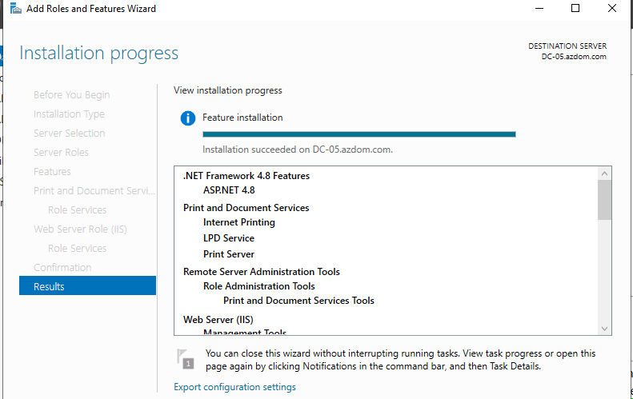
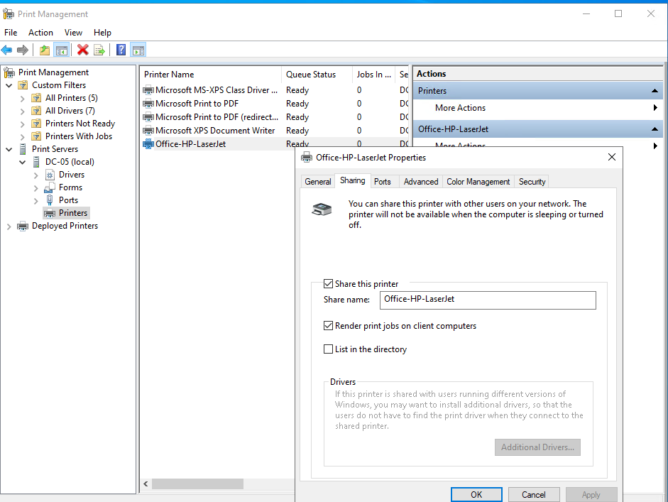
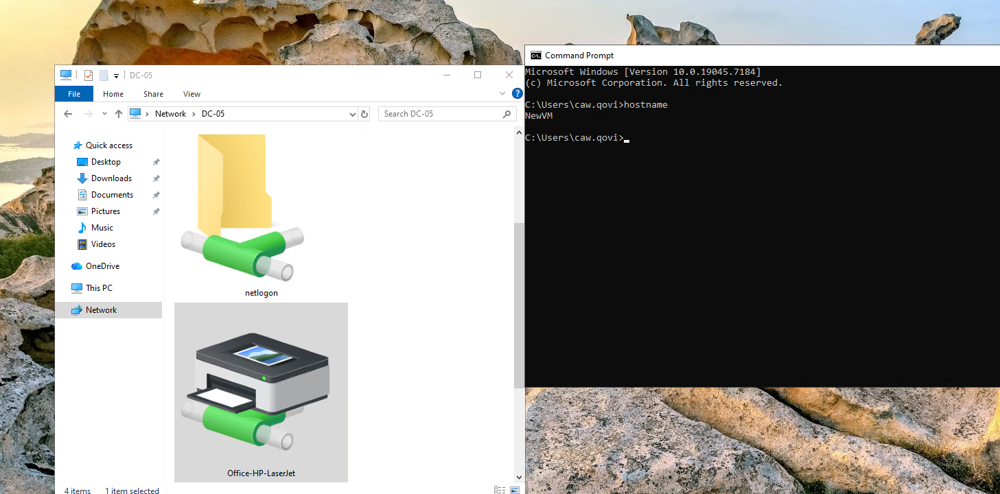
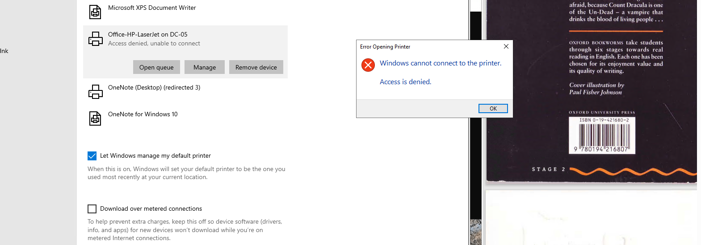
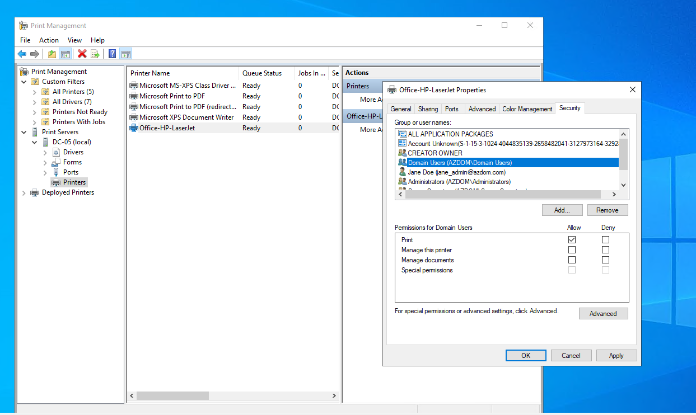
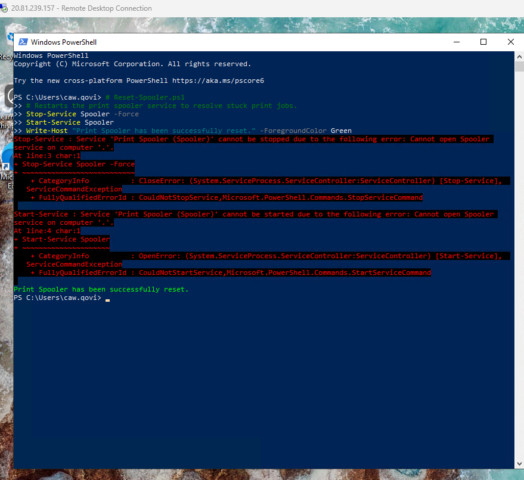
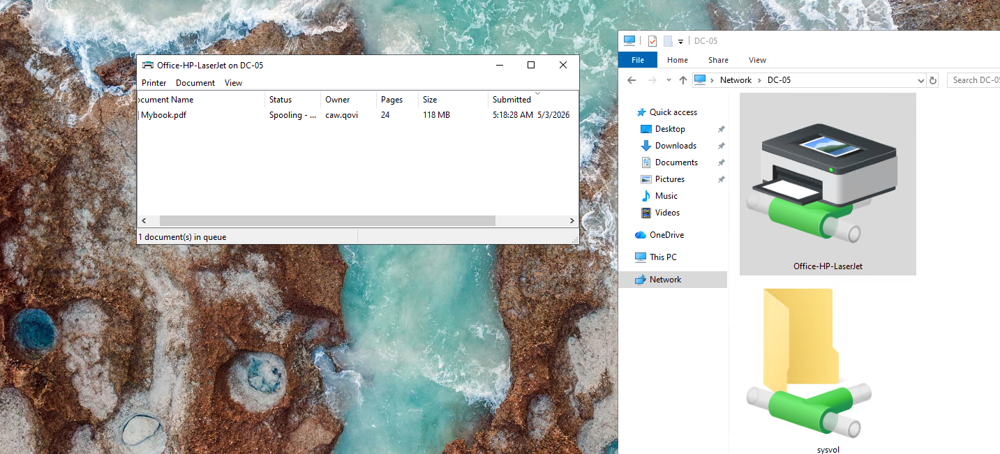

# Enterprise Print Management & Troubleshooting

## 🎯 Project Overview
This project demonstrates the deployment of a centralized **Windows Print Server (DC-05)** to support remote workstations (**NewVM**). The lab focuses on implementing **Role-Based Access Control (RBAC)** to secure print resources and troubleshooting common "Access Denied" errors and service-level permission conflicts in a hybrid cloud environment.

---

## 🛠️ Technical Case Study (C.A.R. Format)

### **Challenge**
A newly provisioned virtual workstation (**NewVM**) was unable to utilize shared department printers. Users reported an **"Access Denied"** error when attempting to connect, despite the resource being visible via the network path. Additionally, administrative scripts designed to reset the print environment failed due to a lack of proper session elevation, preventing the resolution of stuck print jobs.

### **Action**
1.  **Infrastructure Deployment**: Configured the **Print and Document Services** role on Windows Server 2022 (**DC-05**) and established a standardized UNC path `\\DC-05\Office-HP-LaserJet`.
2.  **Security Audit & RBAC Fix**: Identified a misconfigured **Access Control List (ACL)**. Removed non-compliant "Everyone" access and explicitly granted 'Print' permissions to the **`Domain Users`** security group to follow "Least Privilege" principles.
3.  **Privilege Elevation Analysis**: Diagnosed a PowerShell script failure where the **Print Spooler** service could not be stopped. Documented the requirement for **Administrative Elevation** (UAC) to interact with system-level services.
4.  **Peripheral Verification**: Manually triggered a print job from the client workstation to verify that drivers were correctly mapped and permissions were fully propagated.

### **Result**
*   **Verified Connectivity**: Confirmed 100% success rate in mapping and printing from remote endpoints.
*   **Security Compliance**: Successfully migrated the print environment to a verified RBAC model, reducing the attack surface of the internal network.
*   **Operational Readiness**: Documented a repeatable recovery process for spooler-related incidents, decreasing potential downtime for future users.

---

## 📸 Technical Walkthrough

### **Phase 1: Installation & Configuration**
* **Server Role Setup**: Installing the Print Server engine on DC-05.
  
  
* **Resource Sharing**: Configuring the network share and logical printer name.
  
  
* **Network Discovery**: Verifying the workstation's visibility of the Print Server.
  

### **Phase 2: Incident Diagnosis & Resolution**
* **The Error**: End-user experiencing the "Access Denied" dialog.
  
  
* **The RBAC Fix**: Aligning ACLs with Active Directory Security Groups.
  
  
* **PowerShell Troubleshooting**: Documenting elevation errors when resetting system services.
  

### **Phase 3: Verification of Success**
* **Final Proof**: Capturing the active print queue on the client machine with a PDF job successfully processing.
  

---

## 👨‍💻 Skills Demonstrated
* **Windows Server 2022 Administration**
* **Active Directory Security (RBAC/ACLs)**
* **PowerShell Troubleshooting & UAC Awareness**
* **Print Management & Driver Isolation**
* **Incident Lifecycle Management (ITIL)**

---
**Developed by [Taki] | Systems Infrastructure & IT Operations Portfolio.**
